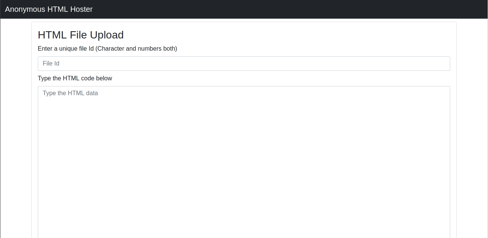

# Anonymous HTML Hoster (NodeJs)

A HTML hoster web application written in NodeJs. The web application serves the purpose of the anonymous sharing of the HTML files over the internet without buying a domain or a hosting server. But, there is one limit to this, you can share only single page HTML files until now. This means that the application is capable of hosting the single page HTML documents until now. So, if you wish to use additional CSS or Javascript in the HTML file, then write them on the same page if possible. Below is a screenshot of the main page of the web application . If you want more details about the working of the application and want some more tutorials the visit the documentation folder [here](docs/).

## Note

Some points to be noted about this project are listed below :

* __Learning Project :-__ This project (application OR tool) is created using NodeJs and this project will be a very good project for all the beginners in nodejs programming as well as those who are new to web developement. The web application uses _express.js_ framework, and the frontend designing is relied on BootStrap CDN which makes the designing part easier, and lets the programmer to focus more on the backend programming.

* __Frontend hardwork :-__ This web application uses the Bootstrap CDN for the frontend designing. But, it is better if we use our own frontend designs using custom CSS and Javascript. This would also make you better in the frontend programming as well. Also note that the bootstrap versions and structures may change as per time, so if there are any glitches in the web pages, then please cooperate it.

* __No use of a database :-__ The backend of the app does not uses any database systems like MySQL, MariaDB, or MongoDB. Instead it uses plain _JSON files_ to store the data and information including the user authentication details and all the thought contents. This reduces the effort of learning a database language and technology for just storing purpose, and here we use just two lines of code to save or extract the data. This also might decrease the time for loading data from the files.

* __Youtube Tutorials :-__ Yes, you've read it right! We have the tutorials of making this web application (OR you can call project), uploaded at [my youtube channel](https://www.youtube.com/channel/UCfp-xR7cpyLOXVW8MYr59WA). You can check it out and get a practical experience of the things that are being done on the screen.

## About author

The application is written by Rishav Das. I am a programmer and know Python (django, general based, data science), Javascript (nodeJs), PHP, C, C++. I have written this tool in intention to expertise the javascript language for the beginners. The tool does not need you to learn any server side programming or any sockets / nodes stuff. If you are new to javascript, here is your first project to start off ;-). I have made several beginner level javascript projects and all are available at my [github profile](https://github.com/rdofficial). One more thing about these projects are that the tutorials of making these projects including coding section, mathematical section are uploaded to [my youtube channel](https://www.youtube.com/channel/UCfp-xR7cpyLOXVW8MYr59WA). If you haven't checked out my videos, check them out on my channel, you would get a better practical experience for the projects.

For the contributors, if you want to update any stuff on these projects, you can just create a pull request or just mail me at _rdofficial192@gmail.com_ with the updates. I'll check it out as soon as possible.